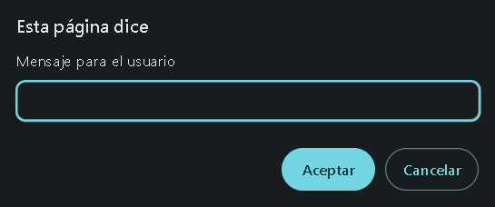
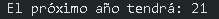

# Introducción a `prompt()` en <b style="color: black; background-color: yellow; border-radius: 3px; padding: 5px;">JavaScript </b>

El método `prompt()` en <b style="color: black; background-color: yellow; border-radius: 3px; padding: 5px;">JavaScript</b> se utiliza para solicitar información al usuario a través de un cuadro de diálogo en el navegador. El usuario puede escribir un valor, y este se almacena como una cadena de texto <b style="color: darkgreen">(string)</b>.

## Sintaxis de `prompt()`.

```JavaScript
let nombre = prompt("Mensaje para el usuario");
```
- `Mensaje para el usuario`: Es el texto que se mostrará en la ventana emergente.
- `nombre`: Almacena el valor ingresado por el usuario.



## Ejemplo básico:

```JavaScript
 let nombre = prompt("Ingrese su nombre:");
 console.log("Hola, "+ nombre);
```
Si el usuario escribe *"Juan"*, la consola mostrará:


## Conversión de datos en `prompt()`

Como `prompt()` siempre devuelve un <b style="color: darkgreen">string</b>, si necesitamos un número, debemos convertirlo con `Number()`, `parseInt` o `parseFloat()`, dependiendo del tipo de dato que necesitemos. También es importante validar la entrada con `isNAN()` para evitar errores.

## `Number()`:

*Ejemplo de conversión a número:*
`Number()` convierte un valor a número, pero si la entrada contiene caracteres no numéricos, devuelve a `NaN` (Not a Number).

```JavaScript
let edad = prompt("Ingrese su edad:");
let edadNumero = Number(edad);
console.log("El próximo año tendrá: "+ (edadNumero + 1));
```
Si el usuario escribe **20**, la consola mostrará:



## `parseInt()`:

`parseInt()` convierte el valor en un número entero. Si el usuario ingresa un número con decimales, solo toma la parte entera y descarta el resto.

```JavaScript
let numeroEntero = prompt("Ingrese un número:");
numeroEntero = parseInt(numeroEntero); // Solo toma la parte entera
console.log(numeroEntero);
```

## `parseFloat()`:

`parseFloat()` convierte el valor en un número decimal, permitiendo valores con punto flotante.

```JavaScript
let numeroDecimal = prompt("Ingrese un número con decimales:");
numeroDecimal = parseFloat(numeroDecimal); // Conserva los decimales
console.log(numeroDecimal);
```

## `isNaN()`:

`isNaN()` verifica si un valor es numerico.

```JavaScript
let valor = prompt("Ingrese un número:");
valor = Number(valor);

if (isNaN(valor)) {
    console.log("Error: No ingresó un número.");
} else {
    console.log("Número válido:", valor);
}
```
<hr>

### Tabla Comparativa

| Método       | Convierte             | Acepta decimales | Manejo de texto no numérico |
|-------------|----------------------|------------------|-----------------------------|
| `Number()`  | Cualquier número      | ✅ Sí | `"100px"` → `NaN` |
| `parseInt()` | Solo números enteros  | ❌ No (descarta decimales) | `"100px"` → `100` |
| `parseFloat()` | Números con decimales | ✅ Sí | `"100.5px"` → `100.5` |
| `isNaN()`  | Verifica si NO es número | ❌ No | `"abc"` → `true` (no es número) |
